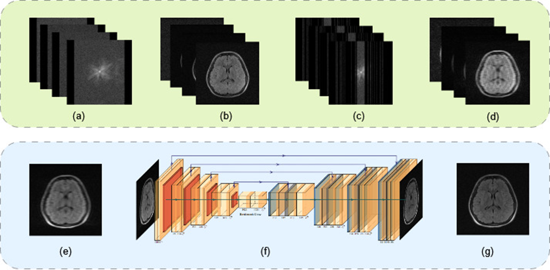

# Deep Learning based Image Domain Reconstruction of Undersampled Low-Field Brain MRI: An Empirical Benchmark of U-Net Architectures

This repository contains pre-processing, model architectures and training code for our paper. 
